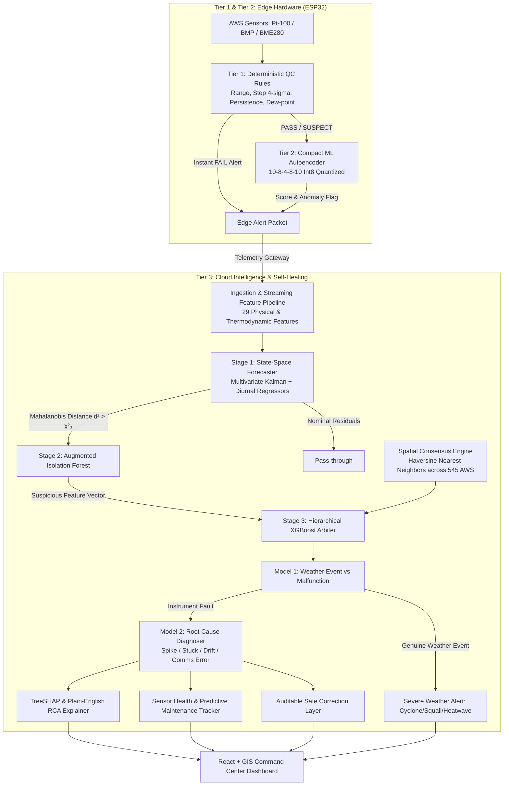

# SkyGuard AI — System Architecture

SkyGuard AI is a multi-tier intelligent anomaly detection, root-cause diagnosis, and self-healing system designed for India's national network of Automatic Weather Stations (AWS).

## Latency & Hardware Specifications

| Tier | Component | Target Hardware | Latency Budget | Memory Footprint |
| :--- | :--- | :--- | :--- | :--- |
| **Tier 1** | Deterministic WMO QC Engine | ESP32 Microcontroller | $< 0.2$ ms | $< 2$ KB SRAM |
| **Tier 2** | Compact Dense Autoencoder | ESP32 Microcontroller | $< 3.5$ ms | $< 40$ KB Flash/SRAM |
| **Tier 3** | Stage 1 Kalman Forecaster | Cloud / Gateway Server | $< 2.0$ ms | $\sim 4$ MB |
| **Tier 3** | Stage 2 Isolation Forest | Cloud / Gateway Server | $< 8.0$ ms | $\sim 2$ MB |
| **Tier 3** | Spatial Consensus Resolver | Cloud / Gateway Server | $< 5.0$ ms | $\sim 1$ MB |
| **Tier 3** | Stage 3 Hierarchical XGBoost | Cloud / Gateway Server | $< 3.0$ ms | $\sim 5$ MB |
| **Tier 3** | TreeSHAP Attributions | Cloud / Gateway Server | $< 4.0$ ms | $\sim 8$ MB |
| **Tier 3** | Sensor Health & Imputation | Cloud / Gateway Server | $< 1.0$ ms | $< 1$ MB |
| **Total** | **Full End-to-End Cloud Latency**| | **$< 25$ ms** | **$< 25$ MB** |
